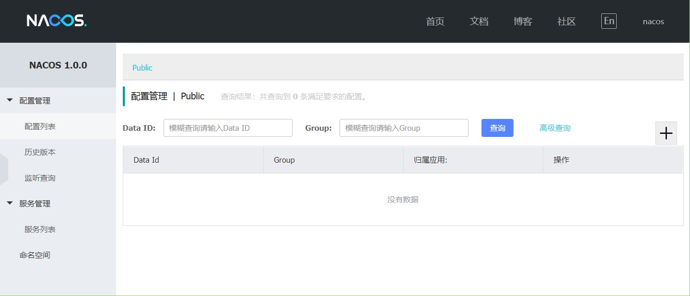
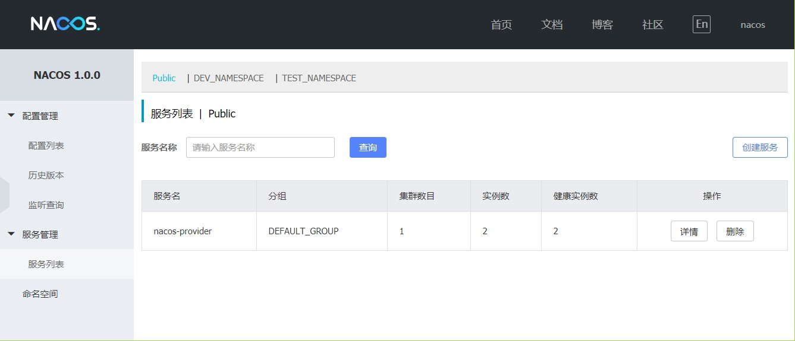
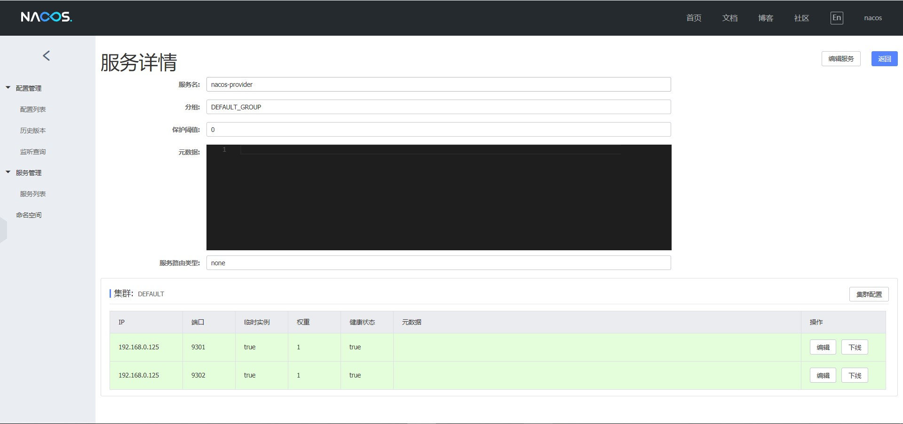
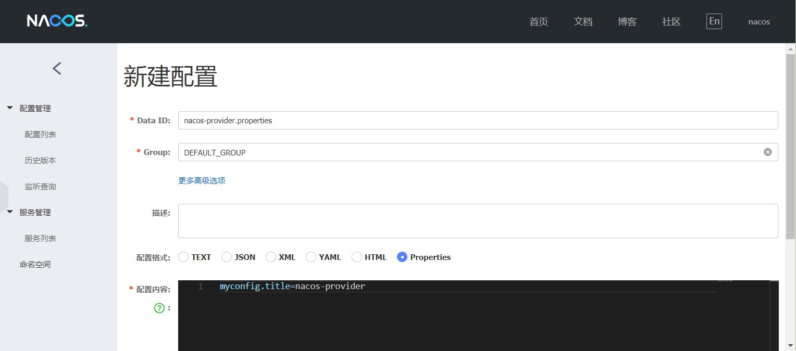
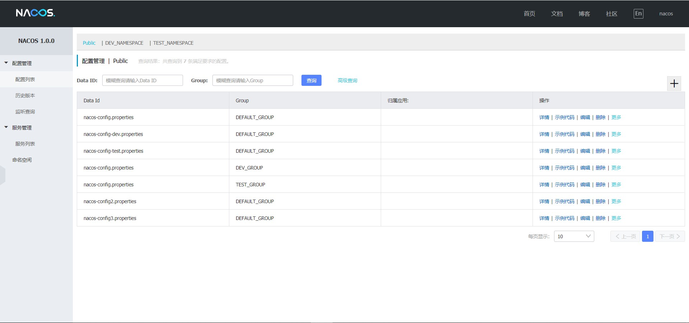
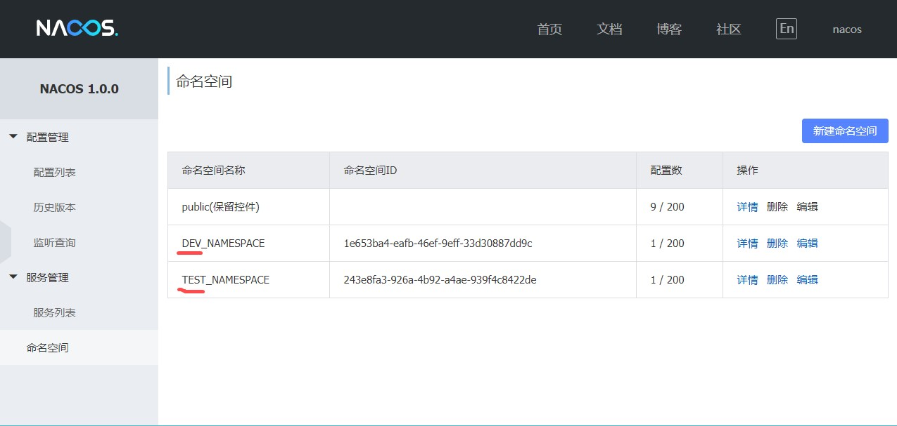
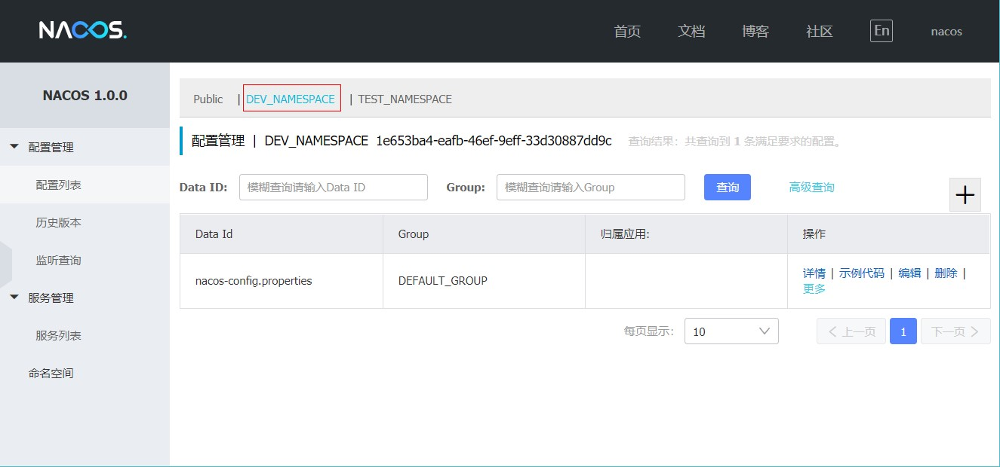
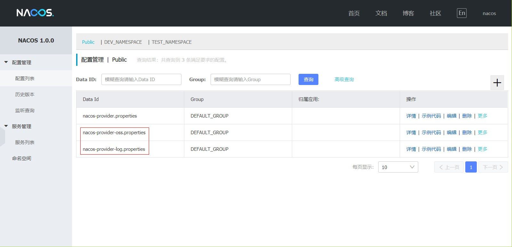
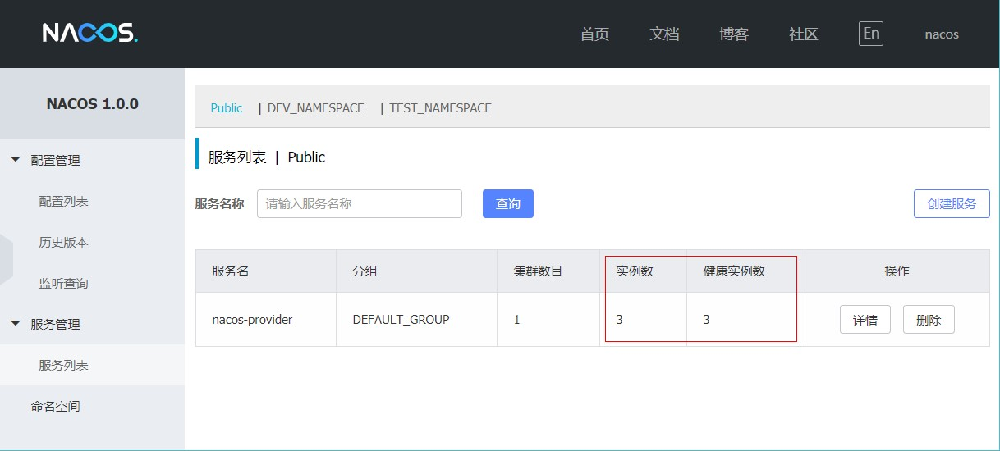
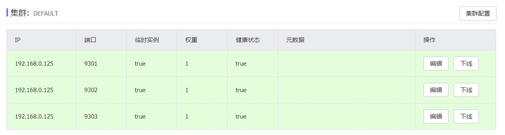

# Spring Cloud Alibaba Nacos

## Nacos服务注册与发现
Nacos致力于帮助我们发现、配置和管理微服务。Nacos提供了一组简单易用的特性集，可以实现动态服务发现、服务配置。

### 安装和启动Nacos
1. 下载地址：https://github.com/alibaba/nacos/releases
2. 本次部署使用的Nacos版本是1.0.0
3. 下载完成之后，解压。找到位于Nacos解压后的bin目录下startup.sh脚本。
4. Linux平台启动Nacos服务(单机版)：nohup sh startup.sh -m standalone &
5. 启动完成之后，访问：http://192.168.1.53:8848/nacos/，进入Nacos的服务管理页面，登录页面中默认用户名密码为：nacos，首页面如下图：

  

### 服务的注册与发现
第一步：创建一个Spring Boot应用，编辑pom.xml，加入必要的依赖配置：

```
    <parent>
        <groupId>org.springframework.boot</groupId>
        <artifactId>spring-boot-starter-parent</artifactId>
        <version>2.0.5.RELEASE</version>
    </parent>

    <properties>
        <project.build.sourceEncoding>UTF-8</project.build.sourceEncoding>
        <project.reporting.outputEncoding>UTF-8</project.reporting.outputEncoding>
        <java.version>1.8</java.version>
        <lombok.version>1.18.6</lombok.version>
    </properties>

    <dependencyManagement>
        <dependencies>
            <dependency>
                <groupId>org.springframework.cloud</groupId>
                <artifactId>spring-cloud-dependencies</artifactId>
                <version>Finchley.SR1</version>
                <type>pom</type>
                <scope>import</scope>
            </dependency>
            <dependency>
                <groupId>org.springframework.cloud</groupId>
                <artifactId>spring-cloud-alibaba-dependencies</artifactId>
                <version>0.2.1.RELEASE</version>
                <type>pom</type>
                <scope>import</scope>
            </dependency>
        </dependencies>
    </dependencyManagement>

    <dependencies>
        <dependency>
            <groupId>org.springframework.boot</groupId>
            <artifactId>spring-boot-starter-web</artifactId>
        </dependency>

        <!--nacos服务发现-->
        <dependency>
            <groupId>org.springframework.cloud</groupId>
            <artifactId>spring-cloud-starter-alibaba-nacos-discovery</artifactId>
        </dependency>
        
        <!--lombok注解-->
        <dependency>
            <groupId>org.projectlombok</groupId>
            <artifactId>lombok</artifactId>
            <scope>provided</scope>
        </dependency>

        <dependency>
            <groupId>org.springframework.boot</groupId>
            <artifactId>spring-boot-starter-test</artifactId>
            <scope>test</scope>
        </dependency>
    </dependencies>
```

上述内容主要三部分：
1. parent：定义spring boot的版本
2. dependencyManagement：引入spring cloud的版本以及spring cloud alibaba的版本。由于spring cloud alibaba还未纳入spring cloud的主版本管理中，所以需要自己加入
3. dependencies：当前应用要使用的依赖内容。这里主要新加入了Nacos的服务注册与发现模块：spring-cloud-starter-alibaba-nacos-discovery。由于在dependencyManagement中已经引入了版本，所以这里就不用指定具体版本了。

第二步：创建应用主类，添加@EnableDiscoveryClient注解，并实现一个HTTP接口:

```
@EnableDiscoveryClient
@SpringBootApplication
public class TestApplication {

    public static void main(String[] args) {
        SpringApplication.run(TestApplication.class, args);
    }

    @Slf4j
    @RestController
    static class TestController {
        @GetMapping("/hello")
        public String hello(@RequestParam String name) {
            return "hello " + name;
        }
    }
}
```

第三步：添加配置  
配置服务名称、端口和Nacos注册地址

```
spring.application.name=nacos-provider
server.port=9301

spring.cloud.nacos.discovery.server-addr=192.168.1.53:8848

```

第四步：启动应用，查看Nacos的服务列表页面
地址：http://192.168.1.53:8848:8848/nacos/#/serviceManagement



这里会显示当前注册的所有服务，以及每个服务的集群数目、实例数、健康实例数。点击详情，我们还能看到每个服务具体的实例信息，如下图所示：



## Nacos配置中心

### 创建配置
进入Nacos的控制页面，在配置列表功能页面中，点击右上角的“+”按钮，进入“新建配置”页面，如下图填写内容：



1. Data ID：填入nacos-provider.properties（nacos-provider是module的ArtifactId）
2. Group：不修改，使用默认值DEFAULT_GROUP
3. 配置格式：这里选择Properties做测试
4. 配置内容：应用要加载的配置内容，这里仅作为示例，做简单配置，比如：myconfig.title=nacos-provider

### 创建应用测试配置
第一步：创建一个Spring Boot应用，编辑pom.xml，加入必要的依赖配置：

```
    <dependencies>
        <dependency>
            <groupId>org.springframework.boot</groupId>
            <artifactId>spring-boot-starter-web</artifactId>
        </dependency>

        <!--nacos配置中心-->
        <dependency>
            <groupId>org.springframework.cloud</groupId>
            <artifactId>spring-cloud-starter-alibaba-nacos-config</artifactId>
        </dependency>

        <dependency>
            <groupId>org.springframework.boot</groupId>
            <artifactId>spring-boot-starter-test</artifactId>
            <scope>test</scope>
        </dependency>
    </dependencies>
```

上述内容主要三部分：
1. Parent
2. dependencyManagement
3. dependencies：需要额外添加spring-cloud-starter-alibaba-nacos-config依赖，就可以读取Nacos的配置信息了

第二步：创建应用主类，并实现一个HTTP接口：

1. 添加title变量，映射到配置文件的myconfig.title的值
2. 然后在http接口中返回该值

```
@SpringBootApplication
public class TestApplication {

    public static void main(String[] args) {
        SpringApplication.run(TestApplication.class, args);
    }

    @Slf4j
    @RestController
    @RefreshScope
    static class TestController {
        @Value("${myconfig.title:}")
        private String title;

        @GetMapping("/test")
        public String hello() {
            return title;
        }
    }
}
```

第三步：添加配置
配置服务名称、端口和Nacos注册地址

```
spring.application.name=nacos-provider
server.port=9301

spring.cloud.nacos.config.server-addr=192.168.1.53:8848
```

第四步：启动应用，调用接口查看返回结果  
用curl或者postman等工具，访问接口: localhost:9301/test，一切正常的话，将返回Nacos中配置的值“nacos-provider”。  
然后，再通过Nacos页面，修改这个内容，点击发布之后，再访问接口，可以看到返回结果变了。

## 配置持久化和集群部署

### MySQL数据源配置
在进行集群配置之前，先完成对MySQL数据源的初始化和配置。主要分两步：

第一步：初始化MySQL数据库，数据库初始化文件：nacos-mysql.sql，该文件可以在Nacos程序包下的conf目录下获得。

第二步：修改conf/application.properties文件，增加支持MySQL数据源配置，添加（目前只支持mysql）数据源的url、用户名和密码。配置样例如下：

```
spring.datasource.platform=mysql
db.num=1
db.url.0=jdbc:mysql://192.168.1.53:3306/nacos_config?characterEncoding=utf8&connectTimeout=1000&socketTimeout=3000&autoReconnect=true
db.user=root
db.password=Gykj123.
```

### Nacos集群部署
在Nacos的conf目录下有一个cluster.conf.example，可以直接把example扩展名去掉来使用，也可以单独创建一个cluster.conf文件，然后打开将后续要部署的Nacos实例地址配置在这里。

以在本地不同端点启动3个Nacos服务端为例，可以如下配置：

```
192.168.1.53:8848
192.168.1.54:8848
192.168.1.55:8848
```

### 启动Nacos实例
在完成了上面的配置之后，我们就可以开始在各个节点上启动Nacos实例，以组建Nacos集群来使用了。

Linux平台分别启动3个Nacos服务（集群方式启动）：nohup sh startup.sh &，使用命令可以查看启动日志：tail -fn 100 nohup.out

1. 启动完成之后可以登录3个Nacos的服务管理页面，在服务列表页面都发现了nacos-provider服务，说明集群启动成功了（注：微服务只需要注册到nacos集群中的一个即可）。
2. 如果Mysql数据库中已存在一些持久化配置那么在3个集群的配置页面就会显示出已有的配置信息，如果没有的话下面我们手动创建配置进行测试，在一个Nacos配置列表页面新建的配置会被同步显示在其他的Nacos配置列表页面。



## Nacos配置的多环境管理
在Nacos中，本身有多个不同管理级别的概念，包括：Data ID、Group、Namespace。只要利用好这些层级概念的关系，就可以根据自己的需要来实现多环境的管理。

### 使用Data ID与profiles实现
Data ID在Nacos中，我们可以理解为就是一个Spring Cloud应用的配置文件名。

第一步：先在Nacos中，根据这个规则，创建两个不同环境的配置内容：


如上图，我们为naocs-provider应用，定义了dev和test的两个独立的环境配置。我们可以在里面定义不同的内容值，以便后续验证是否真实加载到了正确的配置。

第二步：在nacos-provider应用的配置文件中，增加环境配置：spring.profiles.active=dev

第三步：启动应用，调用接口查看返回结果
用curl或者postman等工具，访问接口: localhost:9301/test，一切正常的话，将返回Nacos中配置的值“nacos-provider-dev”。
然后，再通过Nacos页面，修改这个内容，点击发布之后，再访问接口，可以看到返回结果变了。

第四步：然后再修改第二步中的spring.profiles.active=test，重复第三步，发现返回的结果变成了“nacos-provider-test”

### 使用Group实现

Group在Nacos中是用来对Data ID做集合管理的重要概念。例如：开发测试环境和生产环境的资源（如配置、服务）配置集合等。

第一步：先在Nacos中，通过区分Group来创建两个不同环境的配置内容：


如上图，我们为nacos-provider应用，定义了DEV环境和TEST环境的两个独立的配置，这两个匹配与上一种方法不同，它们的Data ID是完全相同的，只是GROUP不同。

第二步：在nacos-provider应用的配置文件中，增加Group的指定配置：spring.cloud.nacos.config.group=DEV_GROUP

第三步：启动应用，调用接口查看返回结果。

### 使用Namespace实现
Namespace用于进行租户粒度的配置隔离。不同的命名空间下，可以存在相同的Group或Data ID的配置。例如：开发测试环境和生产环境的资源（如配置、服务）配置隔离等。

第一步：先在Nacos中，根据环境名称来创建多个Namespace。比如：



第二步：在配置列表的最上方，可以看到除了Public之外，多了几个刚才创建的Namepsace。分别在DEV和TEST空间下为nacos-provider应用创建配置内容：



第三步：在nacos-provider应用的配置文件中，增加Namespace的指定配置，比如：spring.cloud.nacos.config.namespace= 1e653ba4-eafb-46ef-9eff-33d30887dd9c。这里需要注意namespace的配置不是使用名称，而是使用Namespace的ID。

第四步：启动应用，调用接口查看返回结果。

### 关于使用Group和使用Namespace的说明
上面我们分别利用Nacos配置管理功能中的几个不同纬度来实现多环境的配置管理。从结果上而言，不论用哪一种方式，都能够胜任需求，但是哪一种最好呢？
第一种：通过Data ID与profile实现。

优点：这种方式与Spring Cloud Config的实现非常像，用过Spring Cloud Config的用户，可以毫无违和感的过渡过来，由于命名规则类似，所以要从Spring Cloud Config中做迁移也非常简单。

缺点：这种方式在项目与环境多的时候，配置内容就会显得非常混乱。配置列表中会看到各种不同应用，不同环境的配置交织在一起，非常不利于管理。

建议：项目不多时使用，或者可以结合Group对项目根据业务或者组织架构做一些拆分规划。

第二种：通过Group实现。

优点：通过Group按环境讲各个应用的配置隔离开。可以非常方便的利用Data ID和Group的搜索功能，分别从应用纬度和环境纬度来查看配置。

缺点：由于会占用Group纬度，所以需要对Group的使用做好规划，毕竟与业务上的一些配置分组起冲突等问题。

建议：这种方式虽然结构上比上一种更好一些，但是依然可能会有一些混乱，主要是在Group的管理上要做好规划和控制。

第三种：通过Namespace实现。

优点：官方建议的方式，通过Namespace来区分不同的环境，释放了Group的自由度，这样可以让Group的使用专注于做业务层面的分组管理。同时，Nacos控制页面上对于Namespace也做了分组展示，不需要搜索，就可以隔离开不同的环境配置，非常易用。

缺点：没有啥缺点，可能就是多引入一个概念，需要用户去理解吧。

建议：直接用这种方式长远上来说会比较省心。虽然可能对小团队而言，项目不多，第一第二方式也够了，但是万一后面做大了呢？

**注意**：

不论用哪一种方式实现。对于指定环境的配置（spring.profiles.active=dev、spring.cloud.nacos.config.group=DEV_GROUP、spring.cloud.nacos.config.namespace= 1e653ba4-eafb-46ef-9eff-33d30887dd9c），都不要配置在应用的bootstrap.properties中。而是在发布脚本的启动命令中，用-Dspring.profiles.active=DEV的方式来动态指定，会更加灵活！。

### Nacos多配置文件加载与共享配置
我们实际应用过程中还会经常碰到这样的问题：有时候我们会对应用的配置根据具体作用做一些拆分，存储在不同的配置文件中，除了归类不同的配置之外，也可以便于共享配置给不同的应用。

Spring应用对Nacos中配置内容的对应关系是通过下面三个参数控制的：
1. spring.cloud.nacos.config.prefix
2. spring.cloud.nacos.config.file-extension
3. spring.cloud.nacos.config.group

默认情况下，会加载Data ID=${spring.application.name}.properties，Group=DEFAULT_GROUP的配置。

假设现在有这样的一个需求：我们想要对所有应用的Actuator模块以及日志输出做统一的配置管理。所以，我们希望可以将Actuator模块的配置放在独立的配置文件actuator.properties文件中，而对于日志输出的配置放在独立的配置文件log.properties文件中。通过拆分这两类配置内容，希望可以做到配置的共享加载与统一管理。

第一步：在Nacos中创建Data ID=nacos-provider-oss.properties，Group=DEFAULT_GROUP和Data ID=nacos-provider-log.properties，Group=DEFAULT_GROUP的配置内容。



第二步：在Spring Cloud应用中通过使用spring.cloud.nacos.config. shared-dataids参数来配置要加载的这两个配置内容，比如：

```
spring.cloud.nacos.config.shared-dataids=nacos-provider-oss.properties,nacos-provider-log.properties
spring.cloud.nacos.config.refreshable-dataids=nacos-provider-oss.properties,nacos-provider-log.properties
```

1. spring.cloud.nacos.config.shared-dataids参数用来配置多个共享配置的Data Id，多个的时候用逗号分隔
2. spring.cloud.nacos.config.refreshable-dataids参数用来定义哪些共享配置的Data Id在配置变化时，应用中可以动态刷新，多个Data Id之间用逗号隔开。如果没有明确配置，默认情况下所有共享配置都不支持动态刷新
配置加载的优先级：后面加载的配置会覆盖之前加载的配置

## Nacos服务消费方式

### 基础RestTemplate方式
在之前的介绍中我们启动了一个nacos-provider服务，端口为9301，注册到192.168.1.53:8848之后在53,54,55三台集群nacos的服务列表上都可以看到这个服务的3个可用实例，实例数为1。

我们修改启动参数，在启动jar包时添加-Dserver.port=9302或者-Dserver.port=9303，启动之后的效果如下图：




接下来，实现一个应用来消费上面已经注册到Nacos的服务。  
第一步：创建一个Spring Boot应用，命名为：nacos-client。  
第二步：编辑pom.xml中的依赖内容，与上面服务提供者的一样即可。  
第三步：创建应用主类，并实现一个HTTP接口，在该接口中调用服务提供方的接口。  

```
@EnableDiscoveryClient
@SpringBootApplication
public class TestApplication {

    public static void main(String[] args) {
        SpringApplication.run(TestApplication.class, args);
    }

    @Slf4j
    @RestController
    static class TestController {

        @Autowired
        LoadBalancerClient loadBalancerClient;

        @GetMapping("/test")
        public String test() {
            // 通过spring cloud common中的负载均衡接口选取服务提供节点实现接口调用
            ServiceInstance serviceInstance = loadBalancerClient.choose("nacos-provider");
            String url = serviceInstance.getUri() + "/hello?name=" + "gykj";
            RestTemplate restTemplate = new RestTemplate();
            String result = restTemplate.getForObject(url, String.class);
            return "Invoke : " + url + ", return : " + result;
        }
    }
}
```

这里使用了Spring Cloud Common中的LoadBalancerClient接口来挑选服务实例信息。然后从挑选出的实例信息中获取可访问的URI，拼接上服务提供方的接口规则来发起调用。

第四步：配置服务名称和Nacos地址，让服务消费者可以发现上面已经注册到Nacos的服务。

```
spring.application.name=nacos-client
server.port=9304

spring.cloud.nacos.config.server-addr=192.168.1.53:8848
```

第五步：启动服务消费者，然后通过curl或者postman等工具发起访问：localhost:9304/test

```
$ curl localhost:9304/test
Invoke : http://localhost:9301/hello?name=didi, return : hello gykj
$ curl localhost:9304/test
Invoke : http://localhost:9302/hello?name=didi, return : hello gykj
$ curl localhost:9304/test
Invoke : http://localhost:9303/hello?name=didi, return : hello gykj
```

可以看到，两次不同请求的时候，真正实际调用的服务提供者实例是不同的，也就是说，通过LoadBalancerClient接口在获取服务实例的时候，已经实现了对服务提供方实例的负载均衡。

### 使用RestTemplate方式
在上一个例子中，已经使用过RestTemplate来向服务的某个具体实例发起HTTP请求，但是具体的请求路径是通过拼接完成的，对于开发体验并不好。但是，实际上，在Spring Cloud中对RestTemplate做了增强，只需要稍加配置，就能简化之前的调用方式。

```
@EnableDiscoveryClient
@SpringBootApplication
public class TestApplication {

    public static void main(String[] args) {
        SpringApplication.run(TestApplication.class, args);
    }

    @Slf4j
    @RestController
    static class TestController {

        @Autowired
        RestTemplate restTemplate;

        @GetMapping("/test")
        public String test() {
            String result = restTemplate.getForObject("http://nacos-provider/hello?name=gykj", String.class);
            return "Return : " + result;
        }
    }

    @Bean
    @LoadBalanced
    public RestTemplate restTemplate() {
        return new RestTemplate();
    }
}
```

可以看到，在定义RestTemplate的时候，增加了@LoadBalanced注解，而在真正调用服务接口的时候，原来host部分是通过手工拼接ip和端口的，直接采用服务名的时候来写请求路径即可。在真正调用的时候，Spring Cloud会将请求拦截下来，然后通过负载均衡器选出节点，并替换服务名部分为具体的ip和端口，从而实现基于服务名的负载均衡调用。

### 使用WebClient方式
WebClient是Spring 5中最新引入的，可以将其理解为reactive版的RestTemplate。下面举个具体的例子，它将实现与上面RestTemplate一样的请求调用：

```
@EnableDiscoveryClient
@SpringBootApplication
public class TestApplication {

    public static void main(String[] args) {
        SpringApplication.run(TestApplication.class, args);
    }

    @Slf4j
    @RestController
    static class TestController {

        @Autowired
        private WebClient.Builder webClientBuilder;

        @GetMapping("/test")
        public Mono<String> test() {
            Mono<String> result = webClientBuilder.build()
                    .get()
                    .uri("http://nacos-provider/hello?name=gykj")
                    .retrieve()
                    .bodyToMono(String.class);
            return result;
        }
    }

    @Bean
    @LoadBalanced
    public WebClient.Builder loadBalancedWebClientBuilder() {
        return WebClient.builder();
    }
}
```

可以看到，在定义WebClient.Builder的时候，也增加了@LoadBalanced注解，其原理与之前的RestTemplate时一样的。

### 使用Feign方式
上面介绍的RestTemplate和WebClient都是Spring自己封装的工具，下面介绍一个Netflix OSS中的成员，通过它可以更方便的定义和使用服务消费客户端。

第一步：在pom.xml中增加openfeign的依赖：

```
<dependency>
    <groupId>org.springframework.cloud</groupId>
    <artifactId>spring-cloud-starter-openfeign</artifactId>
</dependency>
```

第二步：定义Feign客户端和使用Feign客户端：

```
@EnableDiscoveryClient
@SpringBootApplication
@EnableFeignClients
public class TestApplication {

    public static void main(String[] args) {
        SpringApplication.run(TestApplication.class, args);
    }

    @Slf4j
    @RestController
    static class TestController {
        @Autowired
        Client client;

        @GetMapping("/test")
        public String test() {
            String result = client.hello("gykj");
            return "Return : " + result;
        }
    }

    @FeignClient("nacos-provider")
    interface Client {
        @GetMapping("/hello")
        String hello(@RequestParam(name = "name") String name);
    }
}
```

这里主要先通过@EnableFeignClients注解开启扫描Spring Cloud Feign客户端的功能，然后又创建一个Feign的客户端接口定义。

使用@FeignClient注解来指定这个接口所要调用的服务名称，接口中定义的各个函数使用Spring MVC的注解就可以来绑定服务提供方的REST接口，比如下面就是绑定nacos-provider服务的/hello接口的例子。最后，在Controller中，注入了Client接口的实现，并调用hello方法来触发对服务提供方的调用。


